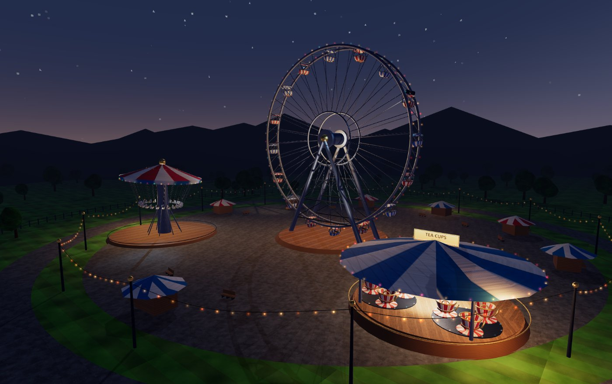
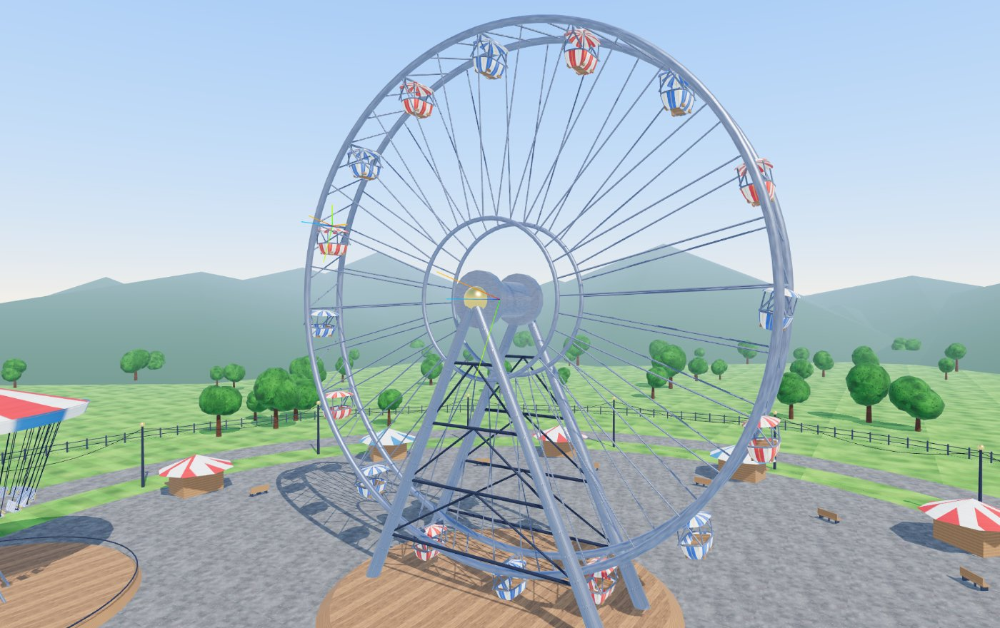
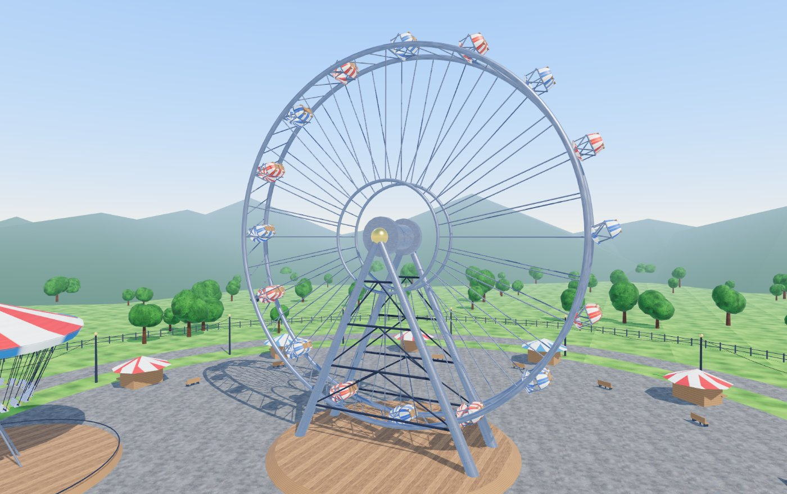
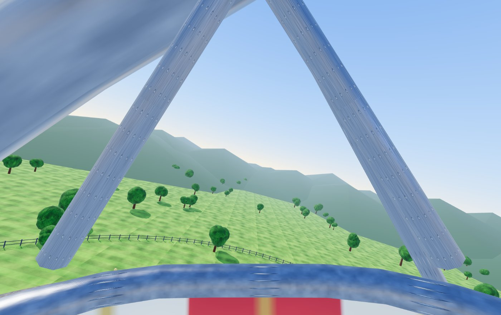

# Demo 1 — Midway

A fairground that runs in a browser: a Ferris wheel whose gondolas stay
level, a swing carousel whose chairs solve for their own flare angle, and
a set of teacups that stack three rotations on one axis. Built with
three.js, rideable from any seat, and rideable in a headset through
WebXR.

| | |
|---|---|
| **Live demo** | <!-- TODO: paste the public HTTPS URL here --> |
| **Video** | <!-- TODO: paste the YouTube link here --> |
| **Stack** | three.js r186 + Vite, no binary assets |
| **Container** | `ghcr.io/ec061/portfolio-1-ec061/demo1-ride:latest` |



---

## What it is

Three rides sit on a plaza inside a fenced park, under a sky that goes
from noon to midnight on a slider. Everything in the scene is generated
in code at load time — the geometry, every texture, the sky, the
lighting. There is not a single downloaded asset, which is why the whole
thing is a 19 kB app chunk plus three.js.

The point of the demo is the **transform hierarchy**. Every moving part
is a frame defined relative to its parent, driven per-frame by code
rather than by an animation clip, and the rides are built so that the
hierarchy is not optional: switch it off from the control panel and the
ride visibly breaks in the way the hierarchy exists to prevent.

---

## What it demonstrates, and how

### 1. Hierarchy of transforms

Five levels on the Ferris wheel, five on the swing carousel, four on the
teacups. `Demo1_Ride/src/rides/*.js` each open with the chain drawn out
in a comment; here is the wheel:

```
rideRoot                        world placement
 └─ spin        (L1)  rotation.z = wheelAngle
     └─ arm[i]   (L2)  fixed offset out to the rim at theta_i
         └─ level[i] (L3)  rotation.z = -wheelAngle     <-- the point
             └─ rock[i]  (L4)  damped pendulum in world gravity
                 └─ seat[i]  (L5)  bench frame
                     └─ camera      rider view
```

**Level 3 is the frame that would be wrong without the hierarchy.** A
gondola's world orientation is the product of every matrix above it, so
the only way to keep the tub upright is to cancel the parent's rotation
in the child's local frame: `level.rotation.z = -wheelAngle`. Untick
**Level gondolas** in the panel (or press <kbd>L</kbd>) and that one line
stops running — the tubs weld to the rim and tip the riders out at the
top. Both answers, live, side by side:

| Levelling frame on | Levelling frame off |
|---|---|
|  |  |

Level 4 depends on level 3 in turn. The pendulum angle is measured
against world gravity, which is only a meaningful thing to measure
because its parent frame is world-aligned. The gondola's pivot is being
swung in a circle, so the tub does not hang along gravity — it hangs
along *effective* gravity, real gravity minus the pivot's centripetal
acceleration:

```js
const aCent = omega * omega * R       // centripetal accel at every pivot
const a  = angle + car.theta          // this gondola's angle, world frame
const gx = aCent * Math.cos(a)
const gy = -G + aCent * Math.sin(a)
const target = Math.atan2(-gx, -gy)   // where the tub wants to hang
```
which is then chased with a damped spring, so the tubs *lag* when the
wheel spins up instead of snapping to the answer. Push the speed slider
to 2.2× and the tilt at the top becomes obvious.

The swing carousel does the same trick with a conical pendulum. A chair
on a chain of length `L`, hinged at radius `r0`, settles where

&nbsp;&nbsp;&nbsp;&nbsp;`tan(φ) = ω²·(r0 + L·sin φ) / g`

which is implicit in φ, so it is solved by fixed-point iteration each
frame and then chased with the same damped spring. Nothing about the
chair's transform mentions the canopy tilt on level 2 — but tilt the
canopy and every chair rises and falls once per revolution anyway,
because that is what inheriting a parent frame means.

The teacups are the purest case: three rotations about three different
moving centres compose into an epitrochoid that nobody authored and that
you would not want to keyframe. In the scene graph it is three numbers.

**A light rig rides on an arm.** Two spotlights and their targets are
parented to gondola arm 4 (`rig.addSpot(..., { parent: rigCar.arm })`),
so their beams sweep the whole park once per revolution with no
per-frame code at all. Same for the bulbs: each festoon strand is
parented into the ride node it belongs to, so the wheel's 120 rim bulbs
rotate for free.

### 2. Complex graphics

- **A model I actually built.** `src/lib/gondola.js` is a hand-authored
  gondola: a closed rounded-rectangle outline (1.5 m across × 2.5 m along
  the axle) swept along a hand-placed 2D profile, capped with a canopy
  fan, floored with a planar-projected deck, and hung from an A-frame.
  2,484 triangles. The UV layout is three deliberately different
  unwraps — see [the UV section](#the-gondola-uvs) below.
- **Every texture is procedural.** `src/lib/textures.js` paints grass
  (with mowing stripes), asphalt, brushed-and-rivetted metal, plank wood
  with grain and ring lines, striped paint, tent canvas, foliage, and the
  midway signage onto 2D canvases at load, then derives a **normal map
  from each** with a Sobel pass (`normalFromHeight`). The rivets on the
  steel and the plank gaps in the deck are normal-mapped, not modelled.
- **Ground, surroundings, sky.** 900 m of ground, a plaza and ring road,
  220 trees, 190 fence posts, 11 booths, 14 lamp posts carrying festoon
  catenaries, an entrance arch with a lit sign, 90 distant hills, and a
  shader sky dome that cross-fades a daytime gradient with a starfield,
  a milky way band and a moon. The dome is also baked to a PMREM
  environment map, so the chrome and the gold reflect the actual sky
  rather than a flat ambient term.

### 3. Interesting lighting

| Light | Type | Day | Night |
|---|---|---|---|
| key | directional, **casts shadows** | 4.2, warm, sun position | 0.18, cold, moon position |
| fill | directional | 0.22 cool bounce | 0.05 |
| hemi | hemisphere sky/ground | 0.45 | 0.07 |
| tower wash | spot + gobo, **casts shadows** | off | 240 |
| arch sign | spot | off | 120 |
| carousel rim | spot + gobo | off | 420 |
| teacup fill | spot | off | 300 |
| **wheel arm rig ×2** | spot + gobo, **parented to a moving arm** | off | 700 / 520 |
| hub, carousel, teacups, 3 lamp posts | point | off | 90–260 |
| 558 bulbs | emissive + additive glow | dull glass | chase / twinkle / pulse |

One directional light does double duty: at `night = 0` it is the sun, and
by `night = 1` it has swung round to the moon position and gone cold and
dim. Cross-fading a single light instead of owning two means exactly one
shadow map is ever allocated and exactly one shadow pass ever runs,
whatever the time of day.

**Where to look for the highlights in the video:** the diffuse term is
clearest on the wooden ride decks, which are pure Lambert (roughness
0.74–0.8, metalness 0). The specular term is clearest on the gold hub cap
and the lamp-post finials (metalness 1.0, roughness 0.22) and on the
rivets in the wheel's steelwork, where the normal map breaks one broad
highlight into a row of small ones. At night the gobo cookie on the tower
spot throws a visible eight-bladed pattern on the plaza.

### 4. Views

Six, switchable with <kbd>1</kbd>–<kbd>6</kbd>. There is exactly one
`PerspectiveCamera`; switching to a rider view **re-parents that camera
into the ride's hierarchy** under the seat frame rather than copying a
transform. That is also what makes the rider view a hierarchy *test*: a
bad parent transform can look plausible from the ground and is
immediately obvious from the seat.

The same re-parenting is what WebXR needs — three's `WebXRManager`
composes the headset pose with `camera.parent.matrixWorld`, so a camera
parented to the seat is a headset bolted to the seat, with no extra code.
(Because the camera's *own* position is ignored in XR, the ground views
get a static standing mount on the plaza that the app switches to on
`sessionstart`.)



### 5. Performance

Measured at 1280 × 800 CSS px, DPR 1.5, Chrome/ANGLE-D3D11 on an
RTX 5060, quality **Medium**:

| | draw calls | triangles | CPU ms/frame |
|---|---|---|---|
| day | 129 | 435,722 | 0.90 |
| night | 141 | 435,842 | 0.91 |
| night, quality High (4096² shadow map) | 141 | 435,842 | 0.97 |
| **night, shadows off** | **71** | **156,782** | **0.42** |

It holds the display's 120 Hz cap with room to spare. The numbers that
matter:

- **Shadows are more than half of everything.** Turning the shadow pass
  off halves the frame time, drops 70 draw calls and 279,000 triangles —
  because the shadow pass re-draws every caster from the light's point of
  view. That is the cost, stated plainly; it buys contact between the
  rides and the ground, which is worth it here.
- **Batching.** All static scenery is authored as ~1,400 loose pieces and
  then merged per material before it reaches the scene
  (`src/lib/environment.js`), so trees, fence, booths, lamp posts,
  festoon cable and hills arrive as about a dozen draw calls. Nothing in
  that batch moves, so the merge costs nothing at runtime — the
  transforms are baked into the vertex buffer once.
- **Instancing through a hierarchy.** The moving parts still need real
  `Object3D` nodes (that is the whole assignment), so the rides keep the
  node chain *and* hand each node's `matrixWorld` to an `InstancedMesh`:
  16 gondolas at 2,484 triangles each in **4** draw calls, 24 carousel
  chairs in 3, 9 teacups in 3.
- **558 bulbs in 22 draw calls.** Each festoon strand is one
  `InstancedMesh` of emissive spheres plus one additive `Points` cloud
  for the bloom, parented into the ride node so the matrices upload once.
  The chase animation writes per-instance *colours*, never transforms.
- **Overdraw** is kept low by making the glow `Points` the only
  significant transparent pass (`depthWrite: false`, additive, drawn
  last), and by keeping `DoubleSide` to exactly two materials — the
  gondola canopy and the teacup lathe, which are open shells with a rider
  underneath.
- Three quality presets (<kbd>Q</kbd>) trade pixel ratio, shadow map
  size (1024²/2048²/4096²) and shadow filtering; the stats panel
  (<kbd>P</kbd>) shows the effect live.

---

## The gondola UVs

Three unwraps on one model, one per material, each chosen for a reason.

**1. Hull and rim — arc-length on both axes.**
`u` is the distance travelled around the outline divided by the total
perimeter; `v` is the distance travelled along the sweep profile divided
by its total length. Neither is index-based, and that is the whole point:
the outline's corner arcs pack sample points close together and its
straight flanks pack them far apart, so an index-based `u` would squeeze
the painted stripes at the corners and stretch them along the sides. With
arc length, every stripe is the same number of centimetres wide the whole
way round, and the seam lands at `u = 0 = 1`, at the stern, where the
hanger bracket hides it. The same reasoning applies to `v` over the
curved bottom of the tub.

**2. Canopy — same `u`, radial `v`.**
The canopy is a fan of scaled copies of the *same* outline, so it reuses
the identical arc-length `u` and runs `v` from 0 at the eave to 1 at the
ridge. Result: the stripes on the roof line up exactly with the stripes
on the hull, for free.

**3. Floor and benches — planar projection.**
`u = x / width`, `v = z / length`, projected straight down Y. Deck planks
are straight, so they get a straight projection. Wrapping the hull's
arc-length unwrap onto the floor would bend the planks around the
corners.

The stripe texture the hull samples is generated in the same repository
(`textures.js → stripes()`), with the band count as an argument — so
"16 stripes around the tub" is literally one number shared between the
texture and the unwrap.

---

## Controls

| Input | Action |
|---|---|
| <kbd>1</kbd> … <kbd>6</kbd> | Midway · Operator · Ride: wheel · Ride: swings · Ride: teacups · Drone |
| drag / scroll | orbit and zoom (ground views only) |
| <kbd>N</kbd> | toggle day ⇄ night (or drag the slider for dusk) |
| <kbd>L</kbd> | **toggle the gondola levelling frame** — the hierarchy demo |
| <kbd>F</kbd> | show the axis triads for each named frame (L1…L5) |
| <kbd>Q</kbd> | cycle quality: Low / Medium / High |
| <kbd>P</kbd> | show/hide the stats panel |
| <kbd>H</kbd> | collapse the control panel |
| <kbd>Space</kbd> | pause the rides |
| panel | ride speed 0 – 2.2×, shadows, bulb glow, **Enter VR** |

The **Enter VR** button appears when the page is served over HTTPS to a
browser with WebXR. In a headset, pick a rider view first; the ground
views drop you at a standing spot on the plaza.

---

## Running it

### Hosted

The public copy is served from the container image below, behind a
reverse proxy that terminates TLS. It has to be HTTPS with no login,
which is what WebXR needs — open it in the Quest browser and the
**Enter VR** button lights up.

```bash
# development
cd Demo1_Ride
npm install
npm run dev            # http://localhost:5173

# production bundle
npm run build && npm run preview
```

### Container

```bash
# pull the published image
docker compose up -d                    # http://localhost:8080

# or build it here
docker compose up -d --build
```

The image is a two-stage build — `node:24-alpine` runs the Vite build,
`nginx:1.29-alpine` serves the result — and it listens on **8080** with a
`/healthz` endpoint. It publishes exactly one plain-HTTP port and expects
an external reverse proxy to terminate TLS, which WebXR requires (a
secure context is mandatory, and nginx sends
`Permissions-Policy: xr-spatial-tracking=(self)`).

Knobs, all optional, via `.env` (see `.env.example`):

| Variable | Default | Purpose |
|---|---|---|
| `MIDWAY_PORT` | `8080` | host port; container side is fixed at 8080 |
| `MIDWAY_IMAGE` | `…/demo1-ride:latest` | pin a SHA tag or digest |
| `BASE_PATH` | `/` | serve from a sub-path, e.g. `/midway/` |

`docker-compose.yml` also carries a commented Traefik label block and a
commented `proxy` external-network stanza for proxying by container name
instead of by published port.

Images are built and pushed to GHCR by
`.github/workflows/demo1-image.yml` on every push to `main` that touches
the app (documentation paths are excluded), tagged `latest`,
`sha-<short>` and by semver on tags.

`linux/amd64` and `linux/arm64` are built **in parallel on runners of
their own architecture** — `ubuntu-latest` and `ubuntu-24.04-arm` — and
merged into one manifest list afterwards with `docker buildx imagetools
create`. There is no QEMU anywhere in the workflow. On a cold cache the
build step went from **57 s** emulating arm64 on an amd64 host to
**20 s** for the slower of the two native builds; total run wall-clock is
about the same, because the merge job adds a second job's startup cost.

The real win is not the seconds. Each architecture now runs its own
image on its own hardware before publishing — `/healthz`, the page body,
the `no-cache` header on the entry document and the `xr-spatial-tracking`
permissions policy. Previously only amd64 was ever executed and the
arm64 half shipped untested, because there was nothing to run it on.

---

## Real-world parameters

The rides are dimensioned from published figures for real machines rather
than from taste. Numbers are in `src/rides/*.js` as named constants at the
top of each file.

| Quantity | Value used | Where it comes from |
|---|---|---|
| Wheel radius | 18 m | Mid-size transportable wheel; for scale, the Wiener Riesenrad is 30.5 m radius ([Wikipedia](https://en.wikipedia.org/wiki/Wiener_Riesenrad)) and the London Eye is 60 m ([Wikipedia](https://en.wikipedia.org/wiki/London_Eye)) |
| Gondolas | 16 | Wiener Riesenrad carries 15; London Eye 32 |
| Wheel period | 38 s / rev at 1× | ≈ 2.8 m/s rim speed, in the range quoted for boarding-at-speed park wheels |
| Carousel period | 9.5 s / rev at 1× | Gives ~0.66 rev/s·r, a flare angle of ~45° at full speed |
| Chain length / hinge radius | 6.4 m / 6.6 m | Typical chair-o-plane proportions |
| Flare angle | solved, not set | Conical pendulum: `tan φ = ω²r/g` ([Wikipedia](https://en.wikipedia.org/wiki/Conical_pendulum)) |
| Gravity | 9.81 m/s² | Standard gravity |
| Gondola pendulum length | 1.85 m | Pivot above the canopy to the tub's centre of mass, measured off the model |
| Eye height, seated | 1.20 m above the gondola floor | Standard seated eye height for adult anthropometry |

Two honest caveats. The wheel and carousel *periods* are chosen to look
right on camera rather than copied from a specific ride's spec sheet — a
real 18 m wheel usually turns slower than this. And the pendulum damping
constants (`c = 1.15` on the wheel, `c = 2.4` on the carousel) are tuned
by eye, not derived; they are the one place in the ride physics where a
number is there because it looked right.

## Third-party assets

**None.** Every mesh, texture, normal map and shader in this demo is
generated by code in this folder. The only dependency is
[three.js](https://threejs.org) (MIT) r186, plus two of its addons —
`OrbitControls`, `VRButton` and `BufferGeometryUtils`. Vite is a
build-time dependency only. Nothing is downloaded at runtime, including
fonts: the UI uses the system font stack and the signage is drawn with
`CanvasRenderingContext2D.fillText`.

---

## Known issues

- **The arm-mounted spotlights do not cast shadows.** A shadow-casting
  spot on a moving parent re-renders its depth map every single frame;
  with two of them the frame cost roughly doubles at night. They are
  deliberately shadowless and the README says so rather than pretending
  it was free.
- **No volumetric beams.** The spotlights light surfaces; you cannot see
  the cone in the air. That needs either a fake cone mesh or a raymarch
  pass, and neither is in here.
- **The canopy underside reads dark.** The canopy is a single-sided shell
  drawn with `side: DoubleSide`, so from inside the gondola three flips
  the normal and the underside is lit from below — i.e. barely. A real
  fix is a second inner skin, which costs more triangles than the
  backface culling it would restore.
- **The environment map pops.** The sky is baked to a PMREM only at
  quarter-steps of the night slider, so dragging it slowly shows four
  small jumps in the reflections on the chrome and gold. Re-baking every
  frame is the alternative and it is not worth it.
- **Instanced ride meshes set `frustumCulled = false`.** Their bounding
  volumes would have to be recomputed every frame, and they are large and
  central enough that culling would almost never fire. It does mean the
  gondolas are submitted even when the camera is pointed away from the
  wheel.
- **Rider views have no head-look on desktop.** In a rider view the mouse
  does nothing; you are locked to the seat's forward direction. It is the
  honest inherited-transform view, but it means you cannot look around
  from the seat without a headset.
- **No WebXR controller input.** Entering VR gives you the ride, not
  interaction — you cannot change view or toggle night from inside the
  headset. Switch settings before entering.
- **The stats panel's "lit / shadow" count is a scene traversal**, so it
  is honest but it is also the most expensive thing in the HUD. It runs
  four times a second, not per frame.
